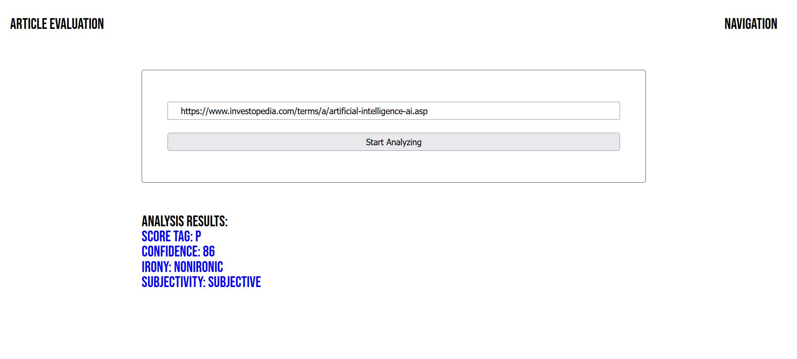

# Udacity project4: Evaluate a News Article with Natural Language Processing

## overview
This project aim to build a tool allow users to run Natural Language Processing (NLP) on articles or blogs found on other websites by the help of MeaningCloud API. You can check the decumentation [here](https://learn.meaningcloud.com/developer/sentiment-analysis/2.1/doc/examples)

**The goal of this project is to give you practice with:**

  - Setting up Webpack
  - Sass styles
  - Webpack Loaders and Plugins
  - Creating layouts and page design
  - Service workers
  - Using APIs and creating requests to external urls


## Getting started

Before start running the tool, you have to download the dependency packages to make sure the tool will work.

The installation command is: 

```
npm install <package name>
```

After the installation for all packages, use the following command to start the developer server. This should open a new window in your browser with the app running on localhost:8080

```
npm run build-dev
```

you can also run the production server (with express), by typing these commands:

```
npm run build-prod
npm run start
```
The first command will create a `dist` folder with the built code.


## Preview 


